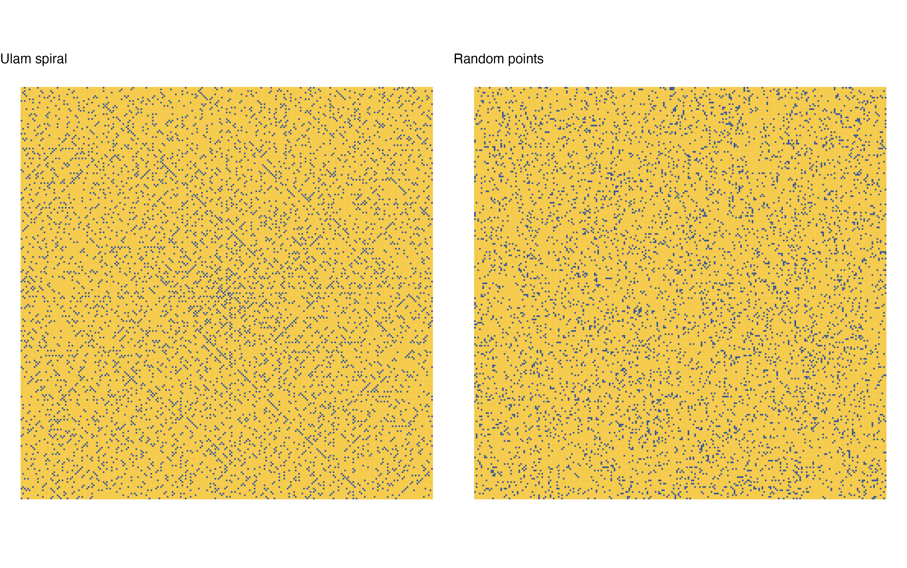

# ulam-spiral

This repo contains the R code to create the Ulam Spiral from the lectures. Compare and contrast the Ulam Spiral pattern with random patterns within the same interval. 

Learning activities:
- Clone this repo to your local machine and run the R code contained within it. You may need to install some packages beforehand.
- Note how the code is formatted. Here, I've used the [Tidyverse style guide](https://style.tidyverse.org/).
